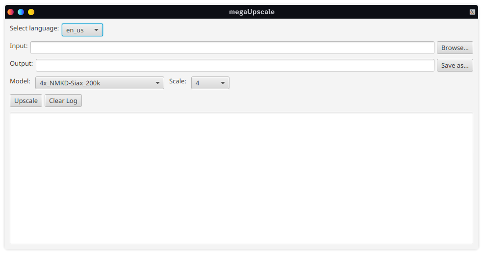

# megaUpscale

AI image upscaling application written in Java.

Supports ESRGAN-based models, customizable settings, and local image processing without cloud services.

*Educational diploma project.*

# Comparison

The `realesr-animevideov3-x4` model was used to upscale an image from `280x280` to `1120x1120`.

| Before                      | After                      |
|-----------------------------|----------------------------|
|  |  |

## Features

- ESRGAN model support
- Custom model loading using `models.json`
- Automatic scale selection based on model type
- Local image processing
- Cross-platform support
- Simple JavaFX interface

## Application Path
- Linux - ~/.config/megaUpscale 
- macOS - ~/Applications/megaUpscale 
- Windows - %APPDATA%/megaUpscale

## Credits
Project uses [Real-ESRGAN ncnn Vulkan binaries](https://github.com/xinntao/Real-ESRGAN-ncnn-vulkan) and [upscayl/custom-models](https://github.com/upscayl/custom-models)

## License

This project is licensed under the GPLv3 License.